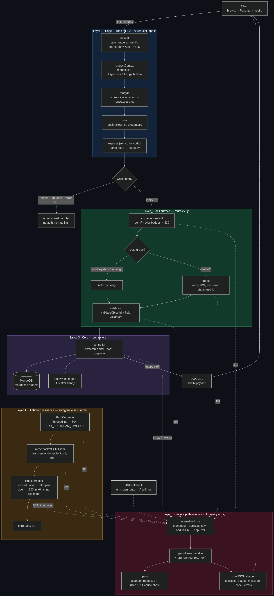
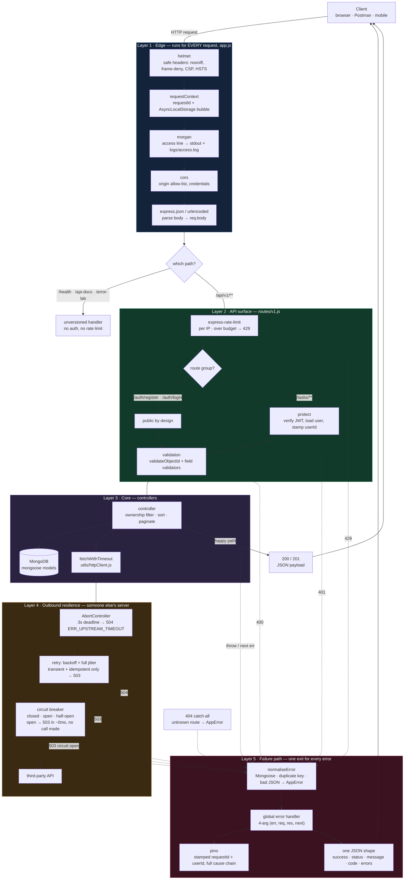

# API structure and features

One page that answers two questions: **what does a request actually pass through in this repo**, and **which production concerns are covered versus still open**.

The diagram is the shape. The tables below are the checklist, grouped by layer, with the exact file to open for each item.

Legend: ✅ built · 💡 partial · ❌ not built

---

## The request lifecycle

Mermaid source (edit this, then run <code>node docs/render-diagram.js</code> to refresh the image)

Two things worth reading off the diagram:

**Order is a design decision, not an accident.** `helmet` is first so even a 404 or a 429 carries security headers. `requestContext` comes before `morgan`, because morgan's `:id` token can only print an id that already exists. Rate limiting sits *outside* `protect`, so a flood of bad tokens is rejected before it costs a database lookup.

**Every failure leaves through one door.** A 401 from auth, a 400 from validation, a 429 from the limiter, a 504 from a timeout and an unexpected `TypeError` all converge on the same handler and produce the same JSON envelope. That envelope is the contract clients code against.

---

## Layer 1 · Edge — security and context

| Feature | What it does | Where | Status |
|---|---|---|---|
| **Safe headers** | `helmet` sets `nosniff`, frame-deny, CSP, HSTS; loosened only on `/api-docs`, which needs inline scripts | `app.js:20`, `app.js:380` | ✅ |
| **Correlation id** | One `requestId` per request, kept in `AsyncLocalStorage` so every later `await` can find it without passing it as an argument | `utils/requestContext.js` | ✅ |
| **CORS** | Origin allow-list from env, split by environment; a rejected origin becomes `403 ERR_CORS`, not a raw throw | `app.js:63` | ✅ |
| **Body parsing** | JSON + form-encoded into `req.body`; a malformed body becomes `400 ERR_MALFORMED_JSON` | `app.js:79` | ✅ |
| **Body size cap** | Express defaults to 100kb. Never explicitly set, so it is a default rather than a decision | `app.js:79` | 💡 |
| **`trust proxy`** | Without it, a proxy makes every client share one IP, so the rate limiter counts them as a single caller | — | ❌ |

## Layer 2 · API surface — who may call what

| Feature | What it does | Where | Status |
|---|---|---|---|
| **Rate limiting** | Per-IP budget, stricter on `/auth` to slow brute force; over budget → `429 ERR_RATE_LIMIT` in the standard error shape | `middleware/rateLimit.js` | 💡 in-memory only |
| **Authentication** | `Bearer` JWT verified before any handler runs; missing, expired and tampered tokens are three distinct 401 codes | `middleware/auth.js` | ✅ |
| **Authorization** | Every query filters on `userId`, so one user cannot read another's task. `role` exists on the model but is never checked — no 403 path | `controllers/task.js`, `models/user.js` | 💡 ownership only |
| **Validation** | Rejects unknown fields, wrong types, bad enums, past dates, oversized arrays, malformed ids — as a per-field `errors[]`, not one vague string | `controllers/task.js:100-233`, `middleware/validateObjectId.js` | ✅ hand-rolled |
| **Versioning** | `/api/v1` mounted in one place, so a future v2 is one more mount instead of edits scattered across route files | `app.js:402`, `routes/v1.js` | ✅ |
| **Docs** | Swagger UI at `/api-docs` and a raw spec at `/api-docs.json`, generated from `@openapi` comments beside each route | `docs/swagger.js` | ✅ |

## Layer 3 · Core — data and performance

| Feature | What it does | Where | Status |
|---|---|---|---|
| **Pagination** | `page` / `limit` with a hard max of 100, so no caller can ask for the whole collection | `controllers/task.js:13-27` | ✅ |
| **Parallel queries** | Count and page fetched with `Promise.all` instead of two sequential round-trips | `controllers/task.js:53` | ✅ |
| **Indexes** | Only the unique index on `email`. Queries filter on `userId` + `status` + `dueDate` with no index behind them, so Mongo scans | `models/user.js` | ❌ |
| **`.lean()` / `.select()`** | List responses hydrate full Mongoose documents and return every field | `controllers/task.js` | ❌ |
| **Compression / caching** | No gzip, no `ETag` strategy, no in-memory or Redis layer | — | ❌ |

## Layer 4 · Outbound resilience — surviving other people's failures

| Feature | What it does | Where | Status |
|---|---|---|---|
| **Timeout** | `AbortController` + `setTimeout` cleared in `finally`, default 3000ms. An infinite hang becomes a predictable `504`, with the `AbortError` kept as `cause` | `utils/httpClient.js` | ✅ |
| **Retries** | Backoff window doubles per attempt, and each wait is a random slice of it, so instances never retry in lockstep — no thundering herd | `utils/httpClient.js` | ✅ |
| **Retry safety** | Only transient statuses retry; only idempotent methods replay; `Retry-After` overrides our maths; a caller-cancelled request never retries | `utils/httpClient.js` | ✅ |
| **Context propagation** | The current `requestId` rides out as an `x-request-id` header, so one id spans the whole hop chain | `utils/httpClient.js` | ✅ |
| **Circuit breaker** | Closed / open / half-open per upstream. Once the failure rate over a rolling window crosses the threshold it stops calling entirely — `503` in ~0ms — then one scout tests recovery after a cooldown | `utils/circuitBreaker.js` | ✅ |
| **Failure classification** | Only health-related outcomes trip the breaker. A `404` counts as success, so other people's bad requests cannot take your dependency offline | `utils/httpClient.js` | ✅ |
| **Shared breaker state** | The registry is per process, so under `cluster` each worker learns about an outage on its own. Shared state needs Redis | `utils/circuitBreaker.js` | ❌ |
| **Fallbacks** | An open circuit returns 503. Stale cache or a degraded response would serve the user better | — | ❌ |
| **Mongo timeouts** | `mongoose.connect` uses defaults — `serverSelectionTimeoutMS` 30s, no `socketTimeoutMS` | `app.js:537` | ❌ |
| **Inbound timeout** | No `server.requestTimeout` / `headersTimeout`, so a handler that hangs holds its connection open | — | ❌ |
| **Idempotency keys** | A client retry of `POST /tasks` creates a second task | — | ❌ |

## Layer 5 · Failure path — errors and observability

| Feature | What it does | Where | Status |
|---|---|---|---|
| **`AppError`** | Operational errors carry `statusCode`, machine-readable `code`, per-field `errors[]` and an optional `cause` | `utils/AppError.js` | ✅ |
| **Cause chaining** | The client sees a clean message while the log keeps the root failure — `Weather service unavailable` *caused by* `ECONNREFUSED`, both stacks intact | `utils/AppError.js`, `app.js:117` | ✅ |
| **`normaliseError`** | Translates library errors — Mongoose validation, `CastError`, duplicate key, JSON parse — into the right 400/409 instead of a lazy 500 | `app.js:441` | ✅ |
| **One error shape** | Known errors return their real message; unknown ones become `500 Something went wrong` and a logged stack, so bugs never leak internals | `app.js:494` | ✅ |
| **404 handler** | Unknown routes get JSON in the same envelope, not an Express HTML page | `app.js:408` | ✅ |
| **Access logs** | One morgan line per finished request, prefixed with `requestId` and `userId` | `app.js:36` | ✅ |
| **App logs** | `pino`, with a mixin that stamps `requestId` + `userId` on every line — grep one id, get the whole story | `utils/logger.js` | ✅ |
| **Health check** | `GET /health` reports Mongo state so a platform can pull a bad instance out of rotation | `app.js:90` | ✅ |
| **Metrics** | No `prom-client`, no `/metrics`, no p95 per route | — | ❌ |
| **Error tracking** | No Sentry or equivalent on top of the pino stream | — | ❌ |
| **Tracing** | No OpenTelemetry. The `requestId` is the poor man's trace and only works because we forward the header ourselves | — | ❌ |
| **Process safety nets** | No `unhandledRejection` / `uncaughtException` handlers, so a floating promise can still kill a worker | — | ❌ |
| **Graceful shutdown** | No `SIGTERM` handler, so a deploy kills in-flight requests mid-write | `server.js` | ❌ |

---

## What a single request touches

`GET /api/v1/tasks/:id` with a valid token, in order:

1. `helmet` attaches security headers — `app.js:20`
2. `requestContext` mints a `requestId`, sets the `X-Request-Id` response header, and opens the ALS bubble — `utils/requestContext.js`
3. `morgan` registers the request; it writes its line only when the response finishes, which is why `:user` is already populated by then — `app.js:36`
4. `cors` checks the `Origin`, `express.json` parses the body — `app.js:63`, `app.js:79`
5. `apiLimiter` checks this IP's budget — `routes/v1.js:10`
6. `protect` verifies the JWT, calls `setContext({ userId })`, loads the user — `middleware/auth.js`
7. `validateObjectId('id')` rejects a malformed id before it reaches Mongo — `middleware/validateObjectId.js`
8. the controller queries with `{ _id, userId }` so ownership is enforced in the query itself — `controllers/task.js`
9. either a JSON payload, or a `next(err)` into `normaliseError` → global handler → pino + one JSON envelope — `app.js:441`, `app.js:494`

Every log line from steps 2–9 carries the same `requestId`. That is the whole point of doing step 2 before step 3.

---

## Where to read more

| Topic | Section |
|---|---|
| Safe headers, what helmet actually sets | [`learn.md` §10b](learn.md#10b-safe-http-headers--what-helmet-actually-does) |
| Rate limiting strategies | [`learn.md` §11](learn.md#11-rate-limiting--what-it-is-strategies-what-we-use) |
| morgan + health check | [`learn.md` §12](learn.md#12-request-logging-morgan--health-check) |
| Correlation id + AsyncLocalStorage | [`learn.md` §12b](learn.md#12b-correlation-id--asynclocalstorage-which-user-was-that) |
| pino, levels, why not `console.log` | [`learn.md` §12c](learn.md#12c-structured-logging-with-pino--levels-json-and-why-not-consolelog) |
| API versioning | [`learn.md` §13](learn.md#13-api-versioning--apiv1) |
| `AppError` + centralized handling | [`learn.md` §14](learn.md#14-centralized-error-handling--the-apperror-class) |
| Performance + observability vocabulary | [`learn.md` §15](learn.md#15-api-performance--observability--the-vocabulary-and-the-loop) |
| One thread, cluster, worker threads | [`learn.md` §19](learn.md#19-how-node-serves-many-users--one-thread-cluster-worker-threads) |
| Timeouts + resource starvation | [`learn.md` §20](learn.md#20-timeouts--abortcontroller-and-resource-starvation) |
| Retries, backoff, jitter | [`learn.md` §21](learn.md#21-retries--exponential-backoff-and-jitter) |
| Circuit breakers + retry budgets | [`learn.md` §22](learn.md#22-circuit-breakers--closed-open-half-open-and-retry-budgets) |
| Remaining task list | [`README.md` — Pending](README.md) |

Live demos for the failure paths: `GET /error-lab` lists every case, including `?case=weather-cause` (cause chaining), `?case=weather-timeout` (the 3s deadline), `?case=retry` (backoff + jitter) and `?case=breaker` (all three breaker states in one request).
