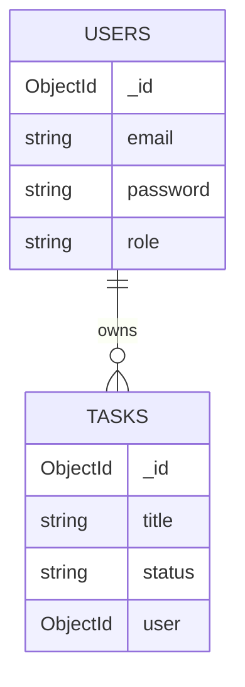
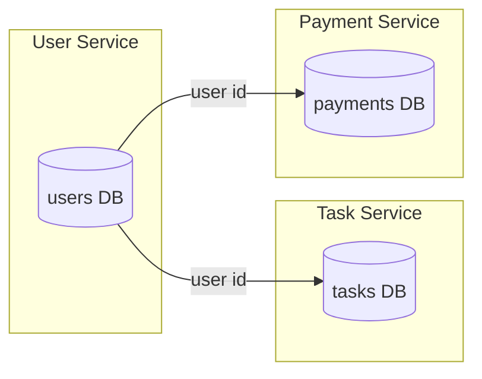
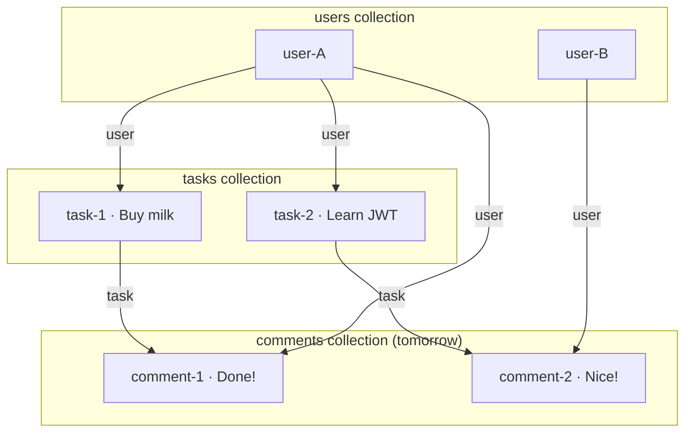

# MongoDB Structure — Todo API

How databases, collections, and documents fit together — and why we use **one collection per feature**, linked by IDs.

---

## Progress legend

| Icon | Meaning |
|------|---------|
| ✅ | How this project works |
| 💡 | Pattern to add later |
| ❌ | Anti-pattern for this app |

---

## Your project today

```
MongoDB
└── todo-app                    ← database (from DB_CONNECTION in .env)
    ├── users                   ← collection (from User model)
    │   ├── document 1          ← { _id: "6a71fb...", email, password, role }
    │   ├── document 2
    │   └── ...
    │
    └── tasks                   ← collection (from Task model)
        ├── document 1          ← { _id: "abc123...", title, status, ... }
        ├── document 2
        └── ...
```

### Key terms

| Term | Your project | Meaning |
|------|--------------|---------|
| **Database** | `todo-app` | Container for collections |
| **Collection** | `users`, `tasks` | Like a table — group of similar documents |
| **Document** | One user or one task | One JSON-like record |
| **`_id`** | Auto on every document | Unique ID (MongoDB creates it) |

### How Mongoose names collections

| Model in code | Collection in MongoDB |
|---------------|------------------------|
| `mongoose.model('User', ...)` | `users` |
| `mongoose.model('Task', ...)` | `tasks` |

Mongoose lowercases + pluralizes the model name.

---

## Two approaches (which one?)

### Option A — All tasks inside the user document ❌

```js
// ONE user document
{
  email: "test@example.com",
  password: "...",
  tasks: [
    { title: "Buy milk", status: "pending" },
    { title: "Call mom", status: "done" },
    { title: "Learn JWT", status: "in-progress" }
    // ... hundreds more
  ]
}
```

Every time the user adds a task, you **update that one big user document** (push into `tasks` array).

### Option B — Each task is its own document ✅

```js
// User document (users collection)
{ _id: "abc123", email: "test@example.com" }

// Task documents (tasks collection)
{ _id: "task1", title: "Buy milk",   user: "abc123" }
{ _id: "task2", title: "Call mom",   user: "abc123" }
{ _id: "task3", title: "Learn JWT", user: "xyz789" }
```

Every time the user adds a task, you **insert a new task document** linked to their `_id`.

---

## Side-by-side comparison

| Question | Option A (all in user doc) | Option B (tasks collection) |
|----------|----------------------------|-----------------------------|
| Add a task | Edit user's doc, push to array | `Task.create({ user: id, ... })` |
| Get my 10 latest tasks | Load whole user doc | `Task.find({ user: id }).limit(10)` |
| User has 5,000 tasks | One huge document | 5,000 small docs — fine |
| Filter/sort tasks | Hard (array operators) | Easy (`find`, `sort`, indexes) |
| Delete one task | Pull from array | `deleteOne` by task `_id` |
| User A sees User B's task | Less risk if data is nested | Need `user` filter (Point 4) |
| Matches your current API | ❌ rewrite everything | ✅ add `user` field |
| Typical REST todo apps | Rare | Standard |

---

## Visual — Option B (what we use)

```
users collection          tasks collection
┌─────────────────┐      ┌──────────────────────────┐
│ _id: user-A     │◄─────│ _id: task-1              │
│ email           │      │ title: "Buy milk"        │
│ password        │      │ user: user-A             │
└─────────────────┘      └──────────────────────────┘
                         ┌──────────────────────────┐
                         │ _id: task-2              │
                         │ title: "Learn JWT"       │
                         │ user: user-A             │
                         └──────────────────────────┘
```

- **1 user → 1 document** in `users`
- **1 task → 1 document** in `tasks`, with `user` pointing to owner

---

## Mermaid — relationships



---

## Two different questions (don't mix them up)

| Question | Answer |
|----------|--------|
| **One user = one document in `users`?** | ✅ **Yes — always** |
| **Every future feature stuffed inside that user document?** | ❌ **No — not for tasks, orders, messages, etc.** |

### The wrong mental model ❌

> "One user, one document, and tomorrow's feature goes in that document"

That only works for **small, rarely-changing** data:

```js
// OK inside user document
preferences: { theme: 'dark', language: 'en' }
profile: { name: 'Ashish', avatar: 'url' }
```

Not for things that **grow without limit**:

```js
// BAD inside user document
tasks: [ ...1000 items... ]
notifications: [ ...5000 items... ]
orders: [ ... ]
payments: [ ... ]
```

That document becomes huge, slow, and painful to update.

---

## When to embed vs separate collection

| Data type | Where it lives |
|-----------|----------------|
| User account (email, password) | `users` — **1 doc per user** |
| Tasks, orders, messages, logs | **Own collection** — **1 doc per item** |
| Small settings (theme, timezone) | Can live **inside** user doc |

### Rule of thumb

| Data type | Where |
|-----------|--------|
| Small, fixed, always loaded with user | Embed in user doc |
| Grows over time, queried alone, CRUD per item | Separate collection + link by ID |

---

## How large enterprises work

### Most common (SQL — banks, Amazon-style systems)

```
users table        tasks table           orders table
id | email         id | user_id | title  id | user_id | total
1  | ash@...       1  | 1       | milk   1  | 1       | 99
```

- **One row per user**
- **One row per task**
- Linked by `user_id` (foreign key)

Same idea as your MongoDB setup — just SQL instead of MongoDB.

### Big apps on MongoDB (Uber, eBay-style patterns)

Same pattern:

```
users          → 1 doc per user
rides          → 1 doc per ride,   { user: ObjectId }
payments       → 1 doc per payment, { user: ObjectId }
notifications  → 1 doc per notif,  { user: ObjectId }
```

**Collection per feature type**, not one mega user document.

### Very large scale (microservices)

Each feature may even have its **own database**:

```
User Service     → users DB
Task Service     → tasks DB
Payment Service  → payments DB
```

Still: **one user record**, **many task records** linked by ID — not one blob per user.



---

## Real-world analogy

**Option A (embed everything)** = one folder per person, all their papers stapled inside one file

**Option B (separate collections)** = a **People** cabinet + a **Tasks** cabinet; each task slip has a name on it

When someone asks *"show me all overdue tasks across my team"*, Option B is simple. Option A means opening every person's folder.

---

## Point 4 — what to add next

Keep:

- `todo-app` database
- `users` collection — one doc per user
- `tasks` collection — one doc per task

Add to each task:

```js
user: {
    type: mongoose.Schema.Types.ObjectId,
    ref: 'User',
    required: true
}
```

Then in controllers:

```js
// Create — attach logged-in user
Task.create({ ...req.body, user: req.user._id })

// Get all — only their tasks
Task.find({ user: req.user._id, ...filter })
```

Same collection, many documents — filtered by **who owns them**.

---

## The pattern (today + tomorrow)

```
Each feature  →  its own collection
Each item     →  its own document
Connection    →  store related IDs on the document
```

---

## Your app today + tomorrow

```
users
├── { _id: "user-A", email: "..." }

tasks
├── { _id: "task-1", title: "Buy milk",  user: "user-A" }
├── { _id: "task-2", title: "Learn JWT", user: "user-A" }

comments  (tomorrow)
├── { _id: "comment-1", text: "Done!",  task: "task-1", user: "user-A" }
├── { _id: "comment-2", text: "Nice!",  task: "task-2", user: "user-B" }
```

Same mechanism every time — **link by `_id`**:

| Collection | Document links to |
|------------|-------------------|
| `tasks` | `user` → who owns it |
| `comments` | `task` → which task, `user` → who wrote it |
| `notifications` (later) | `user` → who gets it |

---

## Visual — full link chain

```
     users                    tasks                    comments
  ┌─────────┐            ┌─────────────┐           ┌─────────────────┐
  │ user-A  │◄───────────│ task-1      │◄──────────│ comment-1       │
  └─────────┘     user   │ user: A     │    task   │ task: task-1    │
       ▲                 └─────────────┘    user   │ user: A         │
       │                         ▲                 └─────────────────┘
       └─────────────────────────┘ user
```



---

## Your project tomorrow

| New feature | Where |
|-------------|--------|
| Comments on tasks | `comments` collection → `{ task, user, text }` |
| User profile photo | `users` document → `profile.avatar` |
| Activity log | `activities` collection → `{ user, action, date }` |

**User doc stays lean.** Growing features get **their own collection**.

---

## One-line summaries

**Don't put all tasks in one user document. Keep one task per document, and add a `user` field so each task belongs to someone.**

**Large enterprises: one user record, many records in feature tables/collections linked by user ID** — same as your `users` + `tasks` setup, not one document per user with everything inside.

**New feature = new collection. Each row/item = one document. Connect with `user`, `task`, etc. — same idea every time.**

That's how most apps scale, including at enterprise level.
